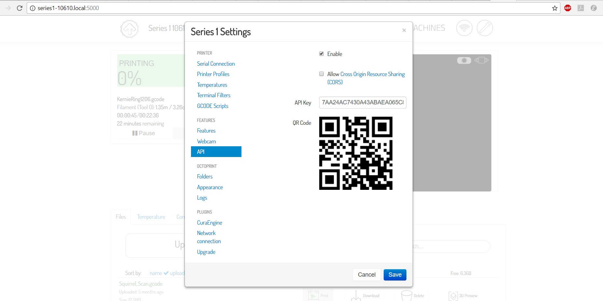
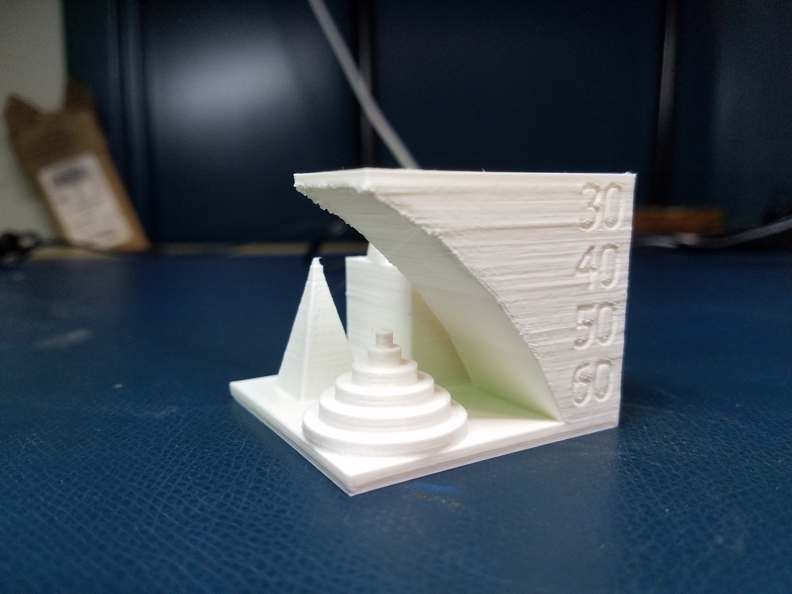

The Series A Pro 3-D printer is a reliable platform that offers a large build volume, flexible controls (including the option to add custom G-code), print monitoring, a large range of print materials. Compared to more beginner-friendly but restrictive options, like the MakerBot, the Series A allows more control and flexibility to the quality, speed, and strength of your print. It also allows the use of more print material options including PLA, PETT, PETG, Nylon, and NijaFlex. 

## Software
The Series A Pro uses a custom version of Cura slicer software,[Cura Type A](https://www.typeamachines.com/downloads#Software), to prepare .STL files for printing. Install, but do not setup Cura until you are ready to setup the Series A Pro on your machine. 

## Getting Started
The Series A Pro uses a web platform to manage and monitor your prints. Once Cura is installed and you have your .STL prepared, turn on the Series A Pro and wait for about 3 minutes. A WiFi network named "Series1-10610" should appear. Connect to this network. 

> You will not have internet access for the remainder of the setup to until you begin your print! Make sure everything you need to print is pre-downloaded.

In a bowser window, go to <http://series1-10610.local:5000>. This should load the Octoprint Series A web interface. 

Once you are connected, open Cura Type A. When prompted, type in our printer's serial number and API key:
- Serial number: 10610
- API Key: Click on the wrench icon in the upper right hand corner of the Series A webpage and go to the API tab. Copy and paste the API key. 

Click the "Configure" button to prepare your printer. Cura Type A should open. 

In order to print, configure and save your .STL file as .GCODE. In your web interface, upload your file and hit "Print" in the upper left corner of the page. You can monitor your print status by checking the webcam feed, tempurature, or GCODE Viewer tabs. 

## Preparing your print
The Series A Pro printer generally uses PLA (as opposed to ABS). PLA requires very different print settings, and trying to print with ABS settings may damage the machine. Generally: 
- Do not print above 220C. 210C is a good starting point.
- The bed tempurature should be around 50C

### Print Profiles
The standard profile is a good compromise between speed and print quality for PLA on the Series A Pro. 
[Download SeriesA_Standard_Profile.zip](assets/SeriesA_Standard_Profile.zip)

## Tips
#### Changing Fillament
Unlike the MakerBot, there is no automating fillament changing funtion. On the Series A web interface, click the "Tempurature" tab and set the printer tempurature to 220C by typing in the indicated text box, clicking enter, and waiting a few seconds for the printer to update. You should see the light red line in the adjacent tempurature graph jump to 220C, and the dark red line should follow. Once the tempurature reaches 220, pull out the old fillament, insert the new fillament, and switch to the "Control" tab. Click the extrude button until the fillament begins to extrude. 

#### Leveling the Build Plate
In theory, the Series A self levels before every build. If you're having any issues with first layer adhesion, turn the printer off and move the print head to the corners. Adjust the leveling screw under each corner until a peice of paper just barely fits between the plate and the nozzel. Repeat this process twice for each corner. 

#### Cleaning the Build Plate
Occasionally, a print will become stuck to the build plate. First, make sure the print and the plate have cooled completely before you try to remove the print. Before you begin a print, put down a fresh layer of painter's tape. Your print should come off of painters tape more smoothely and will not damage the build plate in the even that it gets stuck. 

#### Poor print quality
Cura Type A allows you to adjust almost every aspect of your printer's settings. If you are not satisfied with your print quality, there is almost certainly a fix online. Common problems are:
- "Ringing" on the corners of your prints: Reduce print head acceleration
- Poor platform adhesion after a few layers: Print on a raft, or decrease the surface area that touches the build plate

## Summary
Though there is a steeper initial learning curve, the Series A Pro allows much more flexibility in the quality, speed, and stregth of your 3D prints. 

## See Also

## Further Reading 

## References

<https://typeamachines.zendesk.com/hc/en-us>
